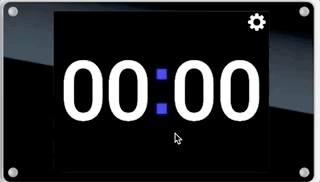

# Simple Timer
This project uses a Moddable-Two display device to provide a simple timer, such as for timing exercise intervals.
Tapping anywhere on the screen resets the timer.
A settings button allows switching between dark and light mode.

### Device software
Prerequisite: follow the steps in the [Moddable Two Getting Started Guide](https://github.com/Moddable-OpenSource/moddable/blob/public/documentation/devices/moddable-two.md)

Run on the simulator:
`mcconfig -d -m`

Deploy to device with WiFi credentials
`mcconfig -d -m -p esp32/moddable_two`

## Credits
Moddable is a trademark of []Moddable Tech Inc.](https://www.moddable.com)

roboto-120.png digits image was generated via https://onlinetexttools.com/convert-text-to-image

Settings icon came from the Moddable examples.

## license
MIT